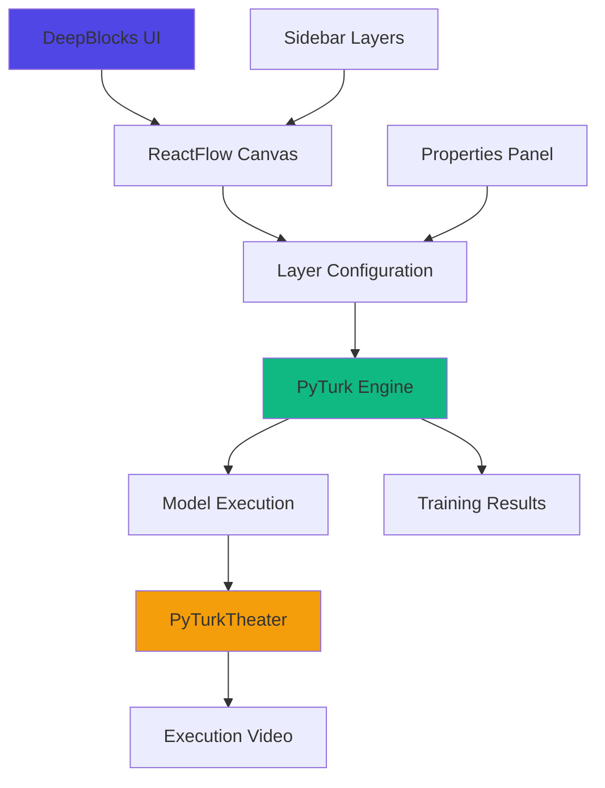

# DeepBlocks 🧠✨

```
This README.md was generated by AI. I kept it because it contains some useful ideas I might reference later.
```

> **Visual Neural Network Builder with PyTurk Execution Engine**  
> *A powerful, intuitive deep learning playground for learners*

    

<!--  -->

## 🎯 What is DeepBlocks?

DeepBlocks is a browser-based visual neural network builder that helps students learn deep learning model creation into an intuitive drag-and-drop experience.

### ✨ Key Features

- **🎨 Visual Node-Based Interface** – Drag, drop, and connect neural network layers with ease
- **⚡ PyTurk Execution Engine** – Powered by [nabin2004/PyTurk](https://github.com/nabin2004/PyTurk), a micro-PyTorch implementation built from scratch
- **🎬 PyTurkTheater Integration** – An optional-video-generation library for PyTurk using Manim
- **🔄 Training Simulation** – Watch your model train with visual feedback
- **📊 Layer Properties Panel** – Fine-tune every parameter with an intuitive UI [not yet implemented]
- **💾 Export Capabilities** – Save your models in multiple formats [not yet implemented]

## 🏗️ Architecture Overview



## Quick Start

### Prerequisites

```bash
# Required Technologies
- Node.js 18+ & npm 9+
- Python 3.8+
- React 18+
- PyTurk (automatically installed)
```

### Installation


# TO BE ADDED 

## 🎮 How to Use DeepBlocks

### 1. Building Your Network
1. **Drag layers** from the sidebar onto the canvas
2. **Connect layers** by dragging from output to input ports
3. **Configure parameters** in the properties panel
4. **Arrange nodes** for optimal visualization

### 2. Training Your Model
```javascript
// Example training configuration
{
  epochs: 50,
  batch_size: 32,
  learning_rate: 0.001,
  optimizer: 'adam',
  loss_function: 'cross_entropy'
}
```

### 3. Exporting Results
- **Model Architecture** – Export as JSON
- **Training Metrics** – CSV download
- **Execution Video** – MP4 via PyTurkTheater
- **Code Generation** – Python/PyTorch scripts

## 🔧 Technical Stack

### Frontend Layer
```yaml
Framework: Nextjs 
Backend: FastAPI
UI Components: shadcn/ui + Tailwind CSS
Flow Library: React Flow
```

### Backend Execution
```yaml
Core Engine: PyTurk (Custom Micro-PyTorch)
Math Backend: NumPy + SciPy
Video Generation: Manim (via PyTurkTheater)
API Layer: FastAPI (Planned)
```

## 🧩 Layer Catalog

DeepBlocks supports a comprehensive range of neural network layers:

| Category | Layers Available | Icon |
|----------|-----------------|------|
| **Input Layers** | Input, Embedding, Image Input | 📥 |
| **Core Layers** | Dense, Conv2D, LSTM, GRU | ⚙️ |
| **Pooling & Norm** | MaxPooling2D, BatchNorm, LayerNorm | 📊 |
| **Activations** | ReLU, Sigmoid, Tanh, Softmax, Dropout | ⚡ |
| **Operations** | Concatenate, Add, Flatten, Reshape | 🔀 |
| **Outputs** | Classification, Regression | 📤 |

## 📚 Educational Value

DeepBlocks serves as an excellent learning tool for:

### For Students
- **Visual understanding** of neural networks
- **Hands-on experience** without coding barriers
- **Experiment freely** with different architectures
- **See theoretical concepts** in action

### For Educators
- **Create teaching materials** quickly
- **Generate visual examples** for lectures
- **Assign interactive projects**
- **Demonstrate complex concepts** visually

## 🎨 UI/UX Highlights

### Intuitive Design
- **Dark/Light mode** support
- **Keyboard shortcuts** for power users
- **Contextual tooltips** for all features
- **Responsive layout** for all screen sizes

### User Experience
- **Undo/Redo** functionality
- **Multiple view modes** (minimal, detailed, presentation)
- **Collaboration features** (planned)
- **Export presets** for common use cases

## 📦 Export & Deployment

## 🤝 Contributing
DeepBlocks is a side project. Contributions are welcome! Here's how you can help:


### Ways to Contribute
1. **Bug Reports** – Found an issue? Open a ticket!
2. **Feature Requests** – Have an idea? Share it!
3. **Code Contributions** – Check "good first issue" tags
4. **Documentation** – Help improve docs
5. **Testing** – Try edge cases and report back


## 📊 Roadmap

### Phase 1: Core Features ✅
- [x] Basic drag-and-drop interface
- [x] PyTurk integration
- [x] Layer property configuration
- [ ] Basic model export

### Phase 2: Enhanced Experience 🚧
- [ ] Advanced training visualization
- [ ] PyTurkTheater full integration
- [ ] Collaborative editing
- [ ] Model zoo/library

### Phase 3: Advanced Features 📅
- [ ] AutoML suggestions
- [ ] Hyperparameter tuning
- [ ] Distributed training

## 🙏 Acknowledgments

DeepBlocks stands on the shoulders of giants:

- **ReactFlow** – For the amazing flow diagram library
- **Manim Community** – For the mathematical animation engine
- **shadcn/ui** – For the beautiful component library

## 📄 License
This project is licensed under the MIT License - see the [LICENSE](LICENSE) file for details.

## 🌟 Support the Project

If you find DeepBlocks useful, please consider:

1. ⭐ **Star the repository** on GitHub
2. 🐛 **Report issues** you encounter
3. 💡 **Suggest features** that would help you
4. 📢 **Share with fellow students** and educators
5. 👨‍💻 **Contribute code** or documentation

---

**Connect with the Developer:**
- GitHub: [@nabin2004](https://github.com/nabin2004)

**Project Links:**
- 🌐 [Live Demo](https://deepblocks.demo)
- 📚 [Documentation](https://docs.deepblocks.ai)
- 🎥 [Video Tutorials](https://youtube.com/deepblocks)
- 💬 [Discord Community](https://discord.gg/deepblocks)

---

*Last updated: November 2024*  
*Made possible by countless cups of coffee ☕ and a passion for democratizing AI education.*